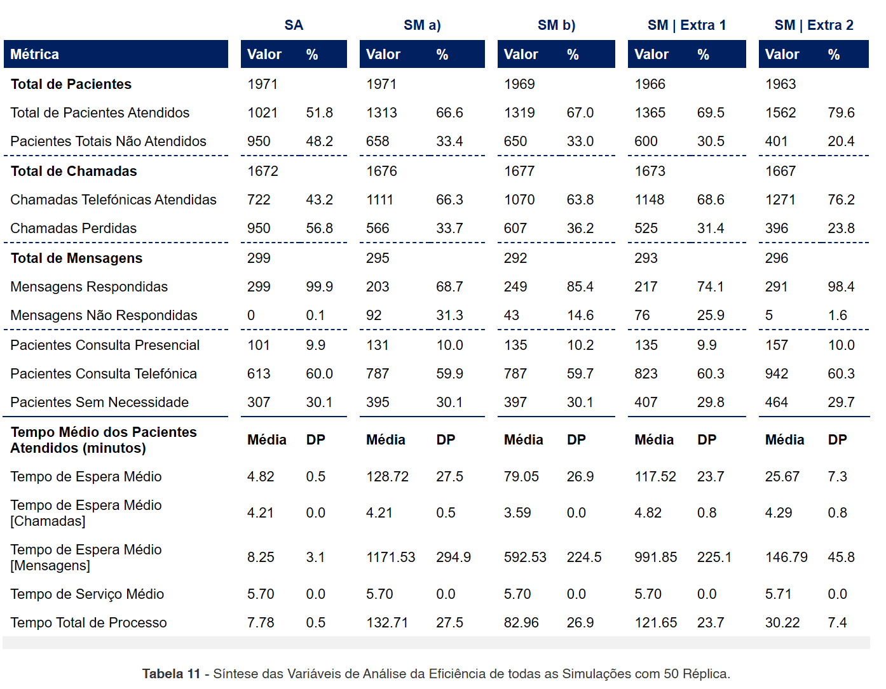

# 🎲 Stochastic Modeling in R: A Practical Portfolio 📈

<p align="center">
  

<p align="center">
    <!-- Project Links -->
    <a href="https://github.com/Silvestre17/StochasticModeling_Projects"></a>
</p>

## 📝 Description

This repository is a collection of projects developed for the **Modelação Estocástica** (*Stochastic Modeling*) course. It demonstrates the practical application of fundamental stochastic processes, including random number generation via the **Acceptance-Rejection method**, **Markov Chain Monte Carlo (MCMC)** simulations, and **Discrete Event Simulation (DES)** for process optimization. All solutions are implemented in the **R programming language**.

## ✨ Objective

The core objective of these projects was to build a strong foundation in computational statistics and simulation by:
*   Implementing classic simulation algorithms from scratch.
*   Conducting comparative studies of statistical estimators using simulated data.
*   Modeling and analyzing complex, real-world systems to identify inefficiencies and propose improvements.
*   Understanding the theoretical underpinnings and practical implications of different stochastic methods.

## 🎓 Project Context

This work was completed for the **Modelação Estocástica** (*Stochastic Modeling*) course as part of the **[Licenciatura em Ciência de Dados](https://www.iscte-iul.pt/degree/code/0322/bachelor-degree-in-data-science)** (*Bachelor Degree in Data Science*) at **ISCTE-IUL**, during the 2023/2024 academic year (1st semester of the 3rd year).

## 🛠️ Technologies & Key Libraries

All assignments were developed using the R ecosystem.

<p align="center">
    <a href="https://www.r-project.org/">
        
    </a>
    <a href="https://www.rstudio.com/">
        
    </a>
    <a href="https://rmarkdown.rstudio.com/">
        
    </a>
    <br>
    <a href="https://cran.r-project.org/web/packages/EnvStats/index.html">
        
    </a>
    <a href="https://www.tidyverse.org/">
        
    </a>
    <a href="https://r-simmer.org/">
        
    </a>
</p>

---

## 📚 Project Breakdown

This repository is organized into three main projects, each tackling a different stochastic modeling challenge.

### 1️⃣ [Project 1: Acceptance-Rejection & Estimator Comparison](./ME_Trabalho%20Pares1_Acceptance-Rejection%20&%20Estimator%20Comparison/)

This project was divided into two main parts: generating random numbers from a custom distribution and comparing the performance of statistical estimators.

*   **Key Concepts:**
    *   **Acceptance-Rejection Method:** Implemented this algorithm to generate 10,000 pseudo-random numbers from a **Triangular distribution**, using the Normal distribution as the proposal function `g(x)`.
    *   **Statistical Estimators:** Conducted a comparative study of two different estimators for the skewness coefficient of a population.
    *   **Monte Carlo Simulation:** Generated 100 samples from a **t-student distribution** for three different sample sizes (n=20, n=100, n=1000).
    *   **Error Metrics:** Calculated the **Standard Error (SE)** and **Mean Squared Error (MSE)** to evaluate and compare the precision and efficiency of the two estimators, concluding a preference for the `s2` estimator.

<p align="center">
  
</p>

### 2️⃣ [Project 2: Metropolis-Hastings (Random Walk MCMC)](./ME_Trabalho%20Pares2_Random%20Walk%20MCMC/)

This project focused on simulating data from a Chi-Squared (χ²) distribution using a Markov Chain Monte Carlo (MCMC) method.

*   **Key Concepts:**
    *   **MCMC:** Explored the **Metropolis-Hastings** algorithm as a method for sampling from complex probability distributions.
    *   **Random Walk:** Implemented the Random Walk variant, where the next proposed state is derived from a symmetric distribution (Normal) centered on the current state.
    *   **Convergence Analysis:** Analyzed four distinct simulation chains, each with a different standard deviation (`σ`) for the proposal distribution, to evaluate how this parameter affects the algorithm's convergence speed and efficiency.

### 3️⃣ [Group Project: Discrete Event Simulation of a Hospital Service](./ME_TrabalhoFinal_DiscreteEventSimulation/)

This was a large-scale project aimed at optimizing the pre-operative contact management process for a hospital's surgery service using Discrete Event Simulation (DES).

*   **Key Concepts:**
    *   **Discrete Event Simulation (DES):** Modeled a complex, dynamic system with stochastic elements (e.g., patient arrival times, call priorities) to analyze its efficiency and identify bottlenecks.
    *   **`simmer` Package:** Utilized this powerful R package to build the simulation environment, define resources (administrative staff), and create patient trajectories.
    *   **Scenario Analysis:**
        1.  **"As-Is" Model:** Simulated the current state, identifying a high rate of lost calls (56.8%) as a major issue.
        2.  **Improvement Scenarios:** Modeled several alternatives, including reallocating staff to different time periods and prioritizing phone calls over messages.
        3.  **"Extra 2" Optimal Scenario:** The best-performing scenario involved adding a dedicated administrative resource for 8 hours a day, which increased patient contact success to nearly 80%.
    *   **Performance Metrics:** The efficiency of each scenario was evaluated based on key metrics like `Total Patients Attended`, `Lost Calls`, `Average Wait Time`, and `Resource Utilization`.

<p align="center">
  
</p>

## 🚀 How to Run the Solutions

1.  **Prerequisites:** Install **R** and **RStudio**.
2.  **Open Project:** Navigate to the desired project folder and open the `.R` or `.Rmd` file in RStudio.
3.  **Install Packages:** Before running, ensure all required libraries are installed. You can do this from the RStudio console:
    ```R
    install.packages(c("EnvStats", "HSAUR2", "psych", "lsr", "nnet", "tree", "simmer", "tidyverse"))
    ```
4.  **Execute Code:**
    *   For `.R` files, you can run the script line-by-line or source the entire file.
    *   For `.Rmd` files, click the **"Knit"** button to generate the complete report with code, output, and analysis.

## 🇵🇹 Note

These projects were developed using Portuguese from Portugal 🇵🇹.